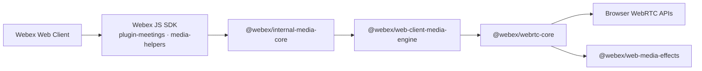

# webrtc-core — Architecture Overview

> High-level design for `@webex/webrtc-core`: browser WebRTC primitives, local and remote streams, device helpers, and integration with `@webex/web-media-effects`. Verify behavior in `src/` and the exports in `src/index.ts`.

---

## 1. Public use and ownership boundary

webrtc-core packages browser WebRTC behavior for reuse instead of requiring each application to implement peer connections, stream classes, device access, and browser differences independently.

[Webex Web Client](https://github.com/webex/webex-web-client) consumes `@webex/plugin-meetings` from the [Webex JS SDK](https://github.com/webex/webex-js-sdk). The SDK's meetings plugin and media helpers consume `@webex/internal-media-core`; internal-media-core consumes WCME; and WCME exact-pins webrtc-core. The middle packages explain dependency ownership, while Webex JS SDK and Webex Web Client show where this behavior reaches SDK consumers and application code.

Each arrow points from a consumer to what it uses. The main path ends at browser APIs, while webrtc-core also consumes `@webex/web-media-effects` to attach effect processors to local streams.

---

## 2. Key dependencies

Dependency versions come from the root `package.json`. `@webex/web-media-effects` is an **exact pin**; other `@webex/*` packages use semver ranges.

| Package | Pin | Role |
|---|---|---|
| `@webex/web-media-effects` | exact | Media effect processors attached through local stream effect APIs |
| `@webex/web-capabilities` | semver | `BrowserInfo` and capability probes used in connection/stream code |
| `@webex/ts-events` | semver | Typed event surfaces shared with other media packages |
| `webrtc-adapter` | semver | Browser normalization for RTCPeerConnection and getUserMedia |
| `js-logger` | semver | Logging |
| `typed-emitter` | semver | Type-safe event emitter (`event-emitter.ts`) |
| `events` | semver | Node-compatible EventEmitter backing |

---

## 3. Key source modules

| Area | Files (under `src/`) |
|---|---|
| Public exports | `index.ts` — semver impact for any export change |
| Peer connection | `peer-connection.ts`, `peer-connection-utils.ts`, `rtc-peer-connection-factory.ts`, `connection-state-handler.ts` |
| Local capture | `media/local-audio-stream.ts`, `local-video-stream.ts`, `local-camera-stream.ts`, `local-microphone-stream.ts`, `local-display-stream.ts`, `local-system-audio-stream.ts`, `local-stream.ts` |
| Remote | `media/remote-stream.ts`, `media/stream.ts` |
| Device APIs | `device/device-management.ts`, `media/index.ts` (getUserMedia, enumerateDevices, permissions) |
| Shared | `errors.ts`, `event-emitter.ts`, `util/logger.ts` |
| Tests | Co-located `*.spec.ts` (Jest); `media.integration-test.ts` (Karma) |
| Mocks | `mocks/` for unit and integration tests |

---

## 4. Release impact

After a published release of `@webex/webrtc-core`, consumers with exact pins must update deliberately:

- `@webex/web-client-media-engine` pins webrtc-core exactly.
- `@webex/internal-media-core` consumes WCME and receives webrtc-core through WCME's dependency chain.

Treat exact-pin bumps in downstream repos as part of delivery when changing published behavior or dependencies.

---

## 5. Further reading

- [Webex JS SDK](https://github.com/webex/webex-js-sdk) — public SDK that exposes meetings and media helpers
- [Webex Web Client](https://github.com/webex/webex-web-client) — public application that consumes the SDK
- [Web Client Media Engine](https://github.com/webex/web-client-media-engine) — direct consumer that exact-pins webrtc-core
- [Web Media Effects](https://github.com/webex/web-media-effects) — exact-pinned effect processor dependency
- [Knowledge base index](../README.md) — repository-local context index
- [AGENTS.md](../../../AGENTS.md) — commands, conventions, Jira/MCP sources
- [README.md](../../../README.md) — local setup and test commands
