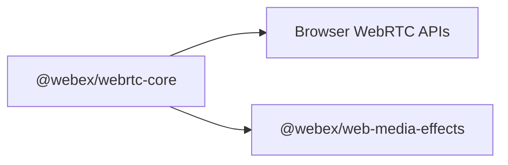

# webrtc-core — Architecture Overview

> High-level design for `@webex/webrtc-core`: browser WebRTC primitives, local and remote streams, device helpers, and integration with `@webex/web-media-effects`. Verify behavior in `src/` and the exports in `src/index.ts`.

---

## 1. Public scope and ownership boundary

webrtc-core packages browser WebRTC behavior for reuse instead of requiring each application to implement peer connections, stream classes, device access, and browser differences independently.

The public [Webex JS SDK](https://github.com/webex/webex-js-sdk) provides application-facing meetings and media APIs. This repository documents only webrtc-core's browser primitives and direct dependencies, not private application implementation paths.

webrtc-core wraps browser WebRTC APIs and consumes `@webex/web-media-effects` to attach effect processors to local streams.

---

## 2. Key dependencies

The root `package.json` is authoritative for the complete dependency list and current versions. The packages below have direct architectural roles in webrtc-core.

| Package | Pin | Role |
|---|---|---|
| `@webex/web-media-effects` | exact | Media effect processors attached through local stream effect APIs |
| `@webex/web-capabilities` | semver | `BrowserInfo` and capability probes used in connection/stream code |
| `@webex/ts-events` | semver | Typed event surfaces shared with other media packages |
| `webrtc-adapter` | semver | Browser normalization for RTCPeerConnection and getUserMedia |

---

## 3. Key source modules

| Area | Files (under `src/`) |
|---|---|
| Public exports | `index.ts` — semver impact for any export change |
| Peer connection | `peer-connection.ts`, `peer-connection-utils.ts`, `rtc-peer-connection-factory.ts`, `connection-state-handler.ts` |
| Local media and effects | `media/local-stream.ts`, `media/local-audio-stream.ts`, `media/local-video-stream.ts`, `media/local-camera-stream.ts`, `media/local-microphone-stream.ts`, `media/local-display-stream.ts`, `media/local-system-audio-stream.ts` |
| Remote media | `media/remote-stream.ts`, `media/stream.ts` |
| Device APIs | `device/device-management.ts`, `media/index.ts` (getUserMedia, enumerateDevices, permissions) |

---

## 4. Releases

semantic-release publishes `@webex/webrtc-core` from `main`. Conventional commits determine the next version, and public API changes must follow semantic-versioning expectations.

---

## 5. Further reading

- [Webex JS SDK](https://github.com/webex/webex-js-sdk) — public SDK that exposes meetings and media helpers
- [Web Media Effects on npm](https://www.npmjs.com/package/@webex/web-media-effects) — exact-pinned effect processor dependency
- [Knowledge base index](../README.md) — repository-local context index
- [AGENTS.md](../../../AGENTS.md) — commands and contribution conventions
- [README.md](../../../README.md) — local setup and test commands
